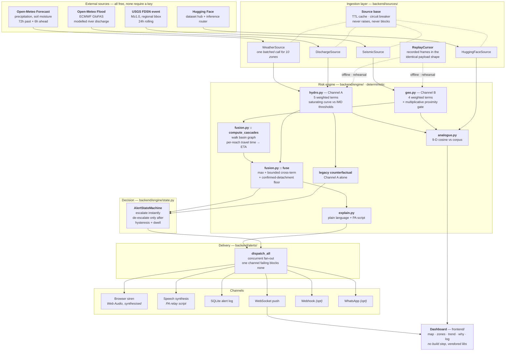
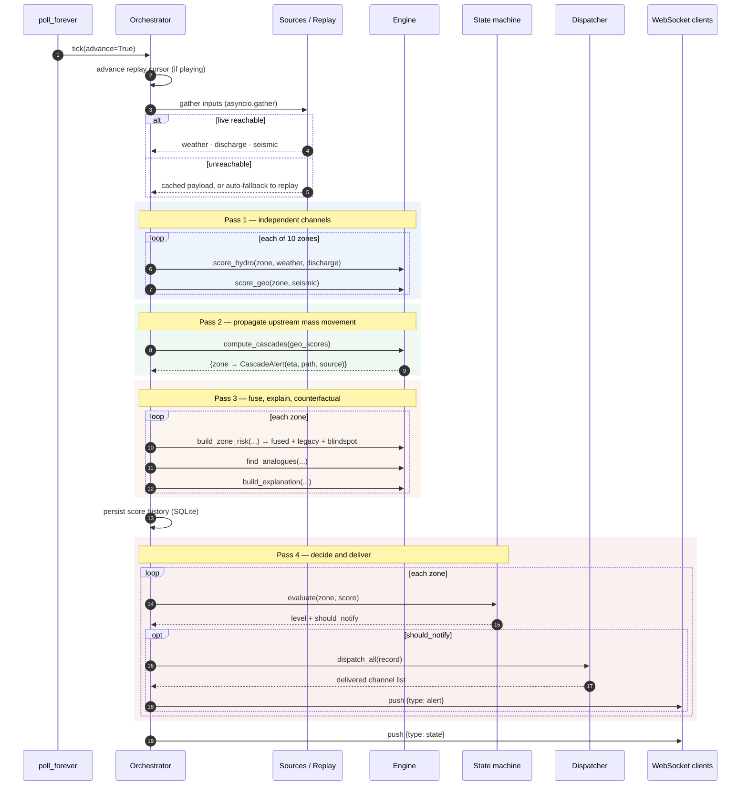
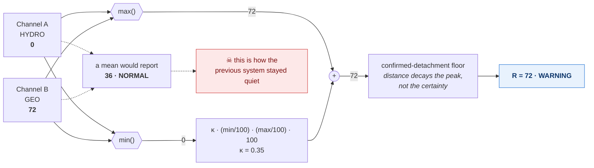
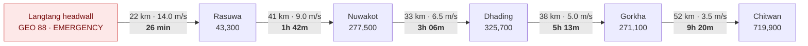
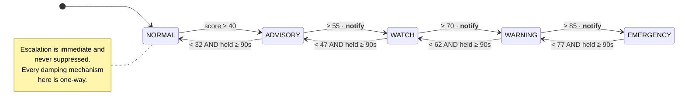
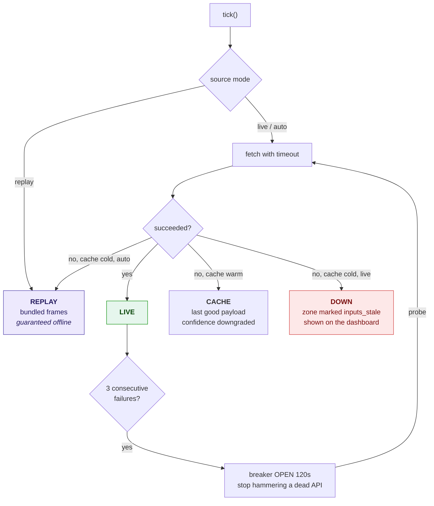

# Architecture

How Prahari is put together, and why each decision was made that way. Every choice
below traces back to one of three constraints: **it must be explainable to a district
officer**, **it must not fail on venue wifi**, and **it must not claim more than it does**.

---

## 1. System overview



---

## 2. The tick loop

One pass through `Orchestrator.tick()` produces one complete `SystemState`, which is what
both the REST snapshot and the WebSocket push serve. **Live and replay share this path
exactly** — nothing in the scoring knows or cares where a number came from. That is what
makes the stage demo a legitimate rehearsal rather than a puppet show.



**Why four passes and not one.** Cascade cannot be computed until every zone's geo score
exists, and fusion cannot run until cascade is known. Collapsing the passes would mean a
zone's inherited threat depended on iteration order — a non-deterministic warning system,
which is disqualifying.

---

## 3. Channel fusion — the central decision



Three properties this gives us, all of which are tested:

1. **A silent channel can never dilute a loud one.** `test_fusion_never_dilutes_a_loud_channel`
2. **Two moderate signals outrank one moderate signal.** `test_fusion_amplifies_two_moderate_channels`
3. **The result is bounded.** `test_fusion_is_bounded`

---

## 4. Cascade propagation

Channel B fires at the *source*. The people at risk are *downstream*. The bridge between
those two facts is the basin reach graph in `data/zones.json`.



**Travel time is summed per reach, not basin-wide.** A debris flood decelerates sharply as
the valley opens — 14 m/s in the gorge, 3.5 m/s across the Chitwan floodplain. A single
average velocity would put Chitwan's arrival hours off, and an arrival time that is wrong
is worse than no arrival time at all, because people plan around it.

**Score transfer:** `transferred = source_geo × 0.85 × exp(−km / 260)`.

**Then the floor.** Once the source score confirms a detachment (≥60), distance is not
allowed to drop a downstream zone below WATCH — or below WARNING within an hour of arrival.
Attenuation is a statement about peak discharge. It is not a statement about whether the
water is coming.

---

## 5. Alert state machine



Three mechanisms, all applying **only to de-escalation**:

| Mechanism | Value | Purpose |
|---|---|---|
| Hysteresis | 8 pts below the band edge | stops the siren flapping around a threshold |
| Minimum dwell | 90 s | stops a single quiet sample clearing an alert |
| Cooldown | 300 s | suppresses re-notifying an unchanged sustained level |

A warning system that cries wolf gets switched off, and a switched-off system has a
detection rate of zero. Damping is a safety feature — but damping an *escalation* would
be lethal, which is why the asymmetry is absolute.

---

## 6. Degradation model

The system has four operating modes and always tells you which one it is in, in the
**Feed health** panel.



A degraded feed is never silently hidden. `ChannelScore.confidence` drops to 0.45 on stale
input and the zone carries `inputs_stale`. An early-warning system that cannot distinguish
*"nothing is happening"* from *"I cannot see"* is dangerous, and that ambiguity is close to
what happened at Langtang when the upstream stations were destroyed.

---

## 7. Frontend

No build step, no framework, no bundler. Plain ES modules, Leaflet and Chart.js **vendored
into the repo** (404 KB) rather than pulled from a CDN.

| Module | Responsibility |
|---|---|
| `api.js` | fetch helpers, WebSocket with exponential-backoff reconnect, level tokens |
| `map.js` | Leaflet; numbered markers, river network, offline-safe |
| `charts.js` | Chart.js; fused vs legacy vs both channels, band markers, table view |
| `siren.js` | Web Audio two-tone sweep + speech synthesis |
| `app.js` | state → DOM, countdown interpolation, controls |

Three deliberate decisions:

- **Vendored libraries.** A CDN is a dependency on someone else's uptime and on the venue's
  firewall. 404 KB in the repo removes both.
- **Numbered map markers, not name labels.** Name labels were tried and collide badly — the
  six Trishuli zones sit within 186 km, so at any zoom that also shows Assam the labels
  overlap into mush. Numbers stay legible at every zoom, and the numbered zone list is the
  legend. The map also degrades gracefully with no basemap: the river network carries the
  geography. **No national borders are drawn** — this is a cross-border basin view, and
  hand-drawn boundaries would be both inaccurate and unnecessary.
- **Client-side countdown interpolation.** The server sends an absolute arrival timestamp;
  the browser ticks every second between polls. A countdown that jumps in 20-second steps
  looks broken, and this one is the emotional core of the demo.

### Accessibility

Risk level is **never carried by colour alone** — every band ships with its name, a numeric
score 0–100, and a glyph. The chart has a table view. Series are direct-labelled at the line
end as well as in the legend. `prefers-reduced-motion` disables the siren flash. The status
palette follows the green/yellow/orange/red convention IMD and district operators already
read; its worst adjacent pair measures ΔE 12.8 under deuteranopia simulation, above the
CVD floor — the normal-vision separation sits marginally under the usual target, which is
inherent to that four-hue severity ramp and is why the label-plus-number pairing is
mandatory rather than decorative.

---

## 8. Data model

```mermaid
erDiagram
  BASIN ||--o{ REACH : "ordered head→mouth"
  REACH }o--|| ZONE : from
  REACH }o--|| ZONE : to
  ZONE ||--o{ WARD : contains
  ZONE ||--|| ZONERISK : "scored each tick"
  ZONERISK ||--|| CHANNELSCORE : hydro
  ZONERISK ||--|| CHANNELSCORE : geo
  CHANNELSCORE ||--o{ CONTRIBUTION : "named, weighted terms"
  ZONERISK ||--o| CASCADEALERT : "inherited threat"
  ZONERISK ||--o{ ANALOGUE : "retrieved"
  ZONERISK ||--o{ ALERTRECORD : raises
  ALERTRECORD ||--o{ DISPATCH : "delivered to"

  ZONE {
    string id PK
    float lat
    float lon
    int population
    float terrain_factor "scales published thresholds"
    float vulnerability "exposure multiplier 0.80-1.20"
    bool geo_watch "in the ground-motion watch set"
    json cryosphere "glacier area, lake count"
  }
  CONTRIBUTION {
    string key
    float raw "the measured value"
    float normalised "0-1 after the curve"
    float weight "fixed, published"
    float points "what reached the score"
    string detail "the sentence shown in the UI"
  }
  CASCADEALERT {
    string source_zone_id
    float distance_km
    float eta_seconds
    float source_score
    bool floored
  }
```

`Contribution` is the load-bearing type. Every number on screen is one of these, carrying
its raw measurement, the threshold it was compared against, its fixed weight, and a
human-readable sentence. **Explainability is a data-structure decision, not a UI feature** —
which is why it cannot rot as the UI changes.

---

## 9. API

| Method | Path | Purpose |
|---|---|---|
| GET | `/api/state` | complete current system state |
| GET | `/api/zones` | zone + basin registry with thresholds |
| GET | `/api/zone/{id}/history` | score history for the trend chart |
| GET | `/api/alerts` | alert log |
| GET | `/api/scenarios` | available scenarios + playback position |
| GET | `/api/health` | per-source health, breaker state, HF status, corpus provenance |
| GET | `/api/methodology` | **the entire scoring formula, as data** |
| POST | `/api/scenario/{id}` | switch data source |
| POST | `/api/playback/{play\|pause\|step\|restart\|seek}` | replay control |
| POST | `/api/engine/{dual\|legacy}` | switch to the counterfactual engine |
| POST | `/api/simulate/{zone}` | fire the alert pipeline on demand |
| WS | `/ws` | push `state` and `alert` frames |

`/api/methodology` exists because "is that hardcoded?" is the first question a technical
judge asks. The answer is `curl localhost:8000/api/methodology` — every weight, curve,
anchor and band edge, served from the same constants the engine imports.

---

## 10. Testing

40 tests. They are written as **assertions of the claims the pitch makes**, so that if a
sentence in the README becomes false, CI says so:

| Test | Claim it defends |
|---|---|
| `test_fusion_never_dilutes_a_loud_channel` | the central design argument |
| `test_geo_ignores_distant_tectonic_quake` | the false-positive guard |
| `test_langtang_blindspot_appears_after_collapse` | the headline number |
| `test_legacy_engine_misses_langtang_entirely` | the stage toggle |
| `test_langtang_stays_dry_throughout` | the argument is not circular |
| `test_assam_both_engines_agree` | we are not overselling against legacy systems |
| `test_cascade_gives_rasuwa_usable_lead_time` | 26 minutes is real |
| `test_escalation_is_immediate` | damping is one-way |
| `test_basin_graph_is_acyclic` | no zone is downstream of itself |

`test_langtang_stays_dry_throughout` is the one that matters most for integrity: it asserts
that no rain ever creeps into the Langtang scenario. Without it, the whole demonstration
could quietly become circular.
