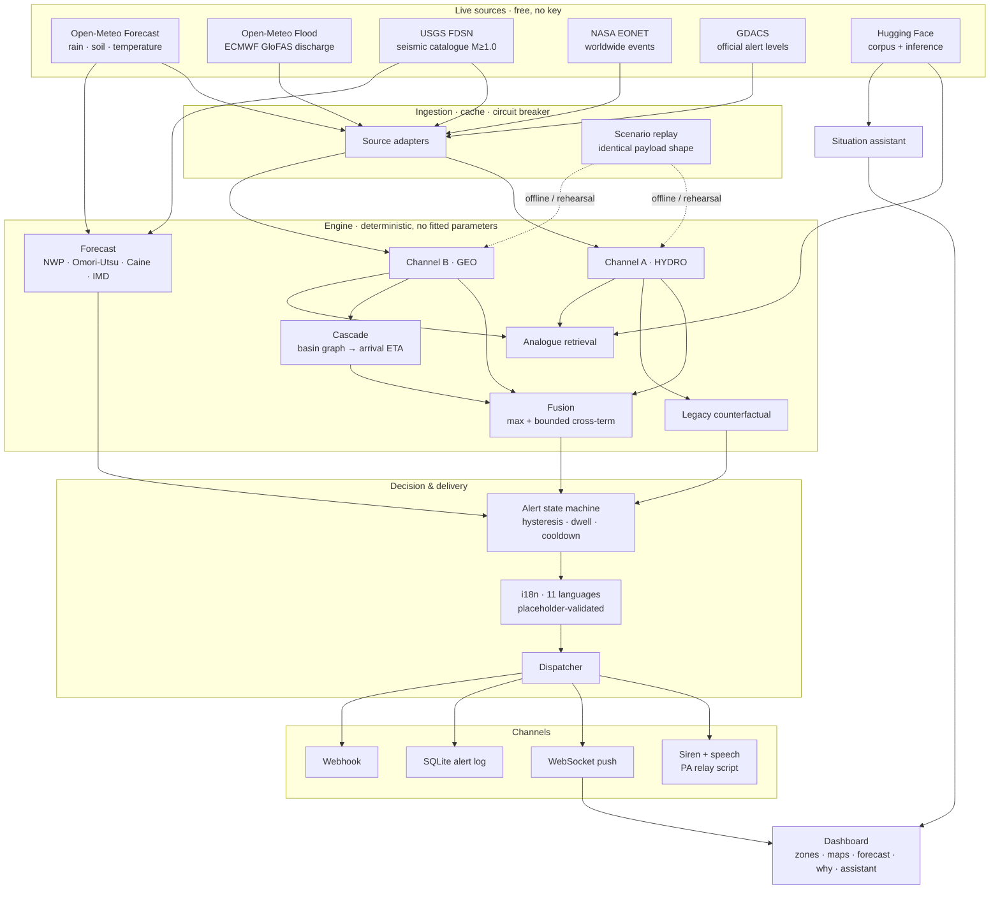

# प्रहरी · PRAHARI

**Multi-hazard early warning — because the last system was listening for rain, not for the mountain moving.**

> On 26 August 2026, a section of the Langtang Lirung glacier collapsed and sent a debris
> flood down the Trishuli valley. 955+ dead. Nearly 4,800 missing. $1.3bn in damage.
>
> **Nepal already had an early warning system.** It did not fail for lack of funding.
> It failed because it was calibrated for monsoon river floods, and this event had no rain
> in it at all. The upstream stations were destroyed before they could report.
>
> Prahari watches both channels, forecasts what it can, detects what it cannot,
> and says which is which — in eleven languages.

---

## Quickstart

```bash
git clone <this repo> && cd Hackathon_BUILD_ANYTHING_20Sept
./run.sh                 # creates the venv, installs deps, starts on :8000
```

Open **http://localhost:8000**. No API keys, no database, no build step, no account anywhere.

```bash
make demo     # guaranteed-offline replay mode  <- use this on stage
make test     # 76 tests
make run      # live feeds, automatic replay fallback
```

**On your phone:** find your laptop's LAN IP (`hostname -I` / `ipconfig getifaddr en0`) and open
`http://<that-ip>:8000`. Mobile-first layout; siren, speech and the assistant all work on a phone browser.

---

## What it does

### 1. Two independent detection channels, fused without dilution

| | **Channel A — HYDRO** | **Channel B — GEO** |
|---|---|---|
| Watches | rainfall intensity, 24h accumulation, intensification trend, modelled river discharge, antecedent saturation | seismic energy, focal depth, mass-movement signature, event clustering |
| Live source | Open-Meteo Forecast API + Open-Meteo Flood API (ECMWF GloFAS) | USGS FDSN event catalogue, queried down to M1.0 |
| Catches | Assam 2026 — slow-onset rainfall floods | Langtang 2026 — clear-sky debris floods |

Fusion is `R = max(A, B) + κ·(min/100)·(max/100)·100`.

**Never a mean.** Averaging a screaming channel with a silent one produces a calm number —
the arithmetic shape of how a two-sensor system talks itself out of an alarm.

### 2. Prediction — with a probability, a method, and its working shown

Four forecasters, each a published method rather than a model fitted to ten incidents:

| Hazard | Method | Horizon |
|---|---|---|
| **Flood** | NWP threshold-exceedance on Open-Meteo (ECMWF/GFS) forecast precipitation | 6–48 h |
| **Aftershock** | Reasenberg & Jones (1989) with Omori-Utsu decay — the method USGS uses operationally | 24 h–30 d |
| **Landslide** | Caine (1980) rainfall intensity–duration threshold `I = 14.82·D^-0.39` | 6–48 h |
| **Extreme heat** | IMD heatwave temperature criteria against the forecast maximum | 48 h |

Cross **90%** and the system raises an alarm **on the forecast alone**, without waiting for
conditions to cross a threshold — because waiting for the threshold means warning people
while the water is already arriving. The threshold is a setting (`PRAHARI_ALARM_PROBABILITY`).

Every probability card shows the method that produced it and the arithmetic behind it:

> **Golaghat — 96% — IMMINENT**
> *Method: NWP threshold-exceedance (Open-Meteo ECMWF/GFS forecast precipitation)*
> 174 mm forecast over 24h plus 68 mm carried from the current window = 242 mm against a
> 116 mm threshold (2.10x). Projected score 100 vs WARNING at 70; forecast spread ±13 over 24h lead time.

**Where a forecast would be dishonest, the system says so instead.** A confirmed glacier
collapse already in motion has no meaningful "probability" — so it gets a **DETECTED** card
with an arrival countdown, not a percentage:

> **Rasuwa — 26m 10s — DETECTED**
> *Not a forecast — a confirmed detachment already in motion.*
> Ground motion detected at Langtang Lirung headwall, 22 km upstream, travelling at 14.0 m/s
> average. This hazard class cannot be predicted in advance; it can only be detected and then outrun.

### 3. A world map of every live hazard, categorised

Nine categories — earthquake, flood, landslide, cyclone, wildfire, volcano, extreme heat,
drought, glacial lake outburst — merged live from three free, key-less global feeds:

- **NASA EONET v3** — curated worldwide natural event tracker
- **GDACS** — the UN/EC alert system, with official Green/Orange/Red levels
- **USGS FDSN** — the earthquake catalogue, folded into the same event stream

Filter by category, click any pin for magnitude, alert level, age and a source link.
Every pin carries its category glyph, so the category survives colour-vision deficiency
and a washed-out projector.

### 4. Downstream cascade with live arrival countdowns

```
Langtang headwall  →  Rasuwa      22 km    26 min
                   →  Nuwakot     63 km   1h 42m
                   →  Dhading     96 km   3h 06m
                   →  Gorkha     134 km   5h 13m
                   →  Chitwan    186 km   9h 20m
```

Summed per reach, because a debris flood decelerates as the valley flattens.
**26 minutes is the entire product.**

Distance decays the expected *peak*, not the fact that water is coming — so once a
detachment is confirmed, every zone in the flow path is floored at WATCH regardless of
distance, and at WARNING inside an hour.

### 5. Eleven languages, including two dialects, with voice

English · हिन्दी · नेपाली · অসমীয়া · বাংলা · **भोजपुरी** · **मैथिली** · తెలుగు · தமிழ் · मराठी · اردو

Alerts are **template-based, not free-form translated**, and every language is validated at
load to carry exactly the same placeholder set as English — a translation that silently
dropped `{eta}` would produce a fluent sentence missing the only number that matters.

Every alert ships with **all eleven translations attached**, so a downstream PA controller
or SMS gateway gets them without another round trip. The two dialects have no TTS voice of
their own; they fall back to a related voice and the UI says so rather than substituting silently.

### 6. A situation assistant that answers by voice, offline

Ask *"what is happening"*, *"am I safe"*, *"kya karu"*, *"ఏమి జరుగుతోంది"* — by typing or by
speaking — and hear the answer read back in your language.

Two tiers, in this order:

1. **Intent matching over live state**, answering from the same translated safety templates
   the sirens use. Works with no token, no model and no network. The safety-critical answers
   live here, because someone asking *"should I leave"* must not depend on an API being up.
2. **Hugging Face inference** for free-form questions, grounded in a state snapshot and
   explicitly forbidden from inventing numbers.

Both speech directions use the browser's own engines — nobody's voice is uploaded anywhere.

### 7. Alerts designed for people without smartphones

The primary channel is an on-screen siren plus speech synthesis, written as relay text for a
**village public-address loudspeaker**:

> *"Emergency flood warning for Rasuwa. A large landslide or ice collapse has been detected
> upstream near Langtang Lirung headwall. Water is expected to reach Rasuwa in about 26 minutes.
> Move away from the river immediately and go to higher ground. **Do not wait for rain.**
> Repeat: move away from the river now."*

*"Do not wait for rain"* is in there because in a clear-sky flood, the absence of rain is
exactly what kills people.

**No messaging-app integration.** It was built and then removed: it required a third-party
sandbox and a pre-registered number, which made the most visible channel the least reliable
one. The generic webhook is the integration point for whatever a real deployment already runs.

### 8. The blind spot, computed live

Every zone is also scored the way a rainfall-only system would score it. Run the Langtang
scenario to the moment of detachment and the dashboard reports:

```
6 zones · 16,37,980 people at risk that a rainfall-only system reports as NORMAL
```

Flip the **Risk engine** toggle to *Legacy (rainfall only)* — the exact configuration that
was live in the Trishuli valley that morning — and watch every one of those zones go green
while the surge is already 45 minutes downstream. Asserted in the test suite:

```python
def test_legacy_engine_misses_langtang_entirely():
    assert all(r.level == "NORMAL" for r in risks.values())
```

---

## Architecture



Full detail in **[ARCHITECTURE.md](ARCHITECTURE.md)** · formulas and honest limits in
**[METHODOLOGY.md](METHODOLOGY.md)** · demo runbook in **[DEMO_SCRIPT.md](DEMO_SCRIPT.md)**.

---

## Hugging Face integration

| Use | Needs a token? | Without one |
|---|---|---|
| **Incident corpus** — authored as a HF dataset with a full card, read via `datasets.load_dataset`, publishable with `make hf-push` | No | Loads from local JSONL; identical content |
| **Assistant free-form answers** | Yes | Rules tier answers in every language |
| **Alert briefings** | Yes | Deterministic template, same information |

```bash
export HF_TOKEN=hf_...
make hf-push        # publishes corpus + card to the Hub
```

**No risk score and no probability is ever model-generated.**

---

## Feature status

**Built and working**

- [x] Live rainfall, soil moisture, temperature and GloFAS river discharge
- [x] Live seismic ingestion at a low magnitude floor, regionally bounded
- [x] Live worldwide hazard events from NASA EONET + GDACS + USGS, 9 categories
- [x] Transparent dual-channel scoring; every weight visible at `/api/methodology`
- [x] Probabilistic forecasting — flood, aftershock, landslide, heat — each with a cited method
- [x] Auto-alarm on forecast probability alone, above a configurable threshold
- [x] DETECTED cards for hazards that cannot honestly be forecast
- [x] Downstream cascade with live arrival countdowns
- [x] Legacy-engine toggle — the counterfactual, computed live
- [x] 11 languages incl. 2 dialects, placeholder-validated, shipped with every alert
- [x] Voice assistant: speech in, speech out, offline intent tier
- [x] Siren + speech written for loudspeaker relay
- [x] Historical analogue retrieval over a Hugging Face dataset
- [x] "Why is this red" panel citing actual numbers and thresholds
- [x] Alert history log with dispatch record and trigger type, in SQLite
- [x] Mobile-responsive, verified at 390px with no horizontal overflow
- [x] Scenario replay for two documented 2026 events
- [x] Feed health panel with circuit-breaker state
- [x] Accessible table view; status never carried by colour alone
- [x] Webhook fan-out for integration with an existing EOC

**Roadmap — described, deliberately not built**

- [ ] Native-speaker review of all 11 translations *(see the warning below)*
- [ ] Community loudspeaker / PA hardware integration
- [ ] SMS fallback for feature phones
- [ ] Official DHM / CWC gauge feeds, replacing the gridded weather proxy
- [ ] Dedicated ground-motion sensor networks for sub-catalogue signals
- [ ] InSAR slope-deformation monitoring as a slow-onset precursor channel
- [ ] **Validation against a historical event catalogue** — the single most important gap

---

## What this is not

- **It does not predict earthquakes.** Channel B detects mass movement that has *already
  started*. The aftershock forecast is conditional on a mainshock that has already happened —
  a solved problem. Forecasting a first earthquake is not.
- **It does not forecast weather.** It consumes published NWP output and scores it.
- **It is not a trained ML model.** Every weight is a fixed published constant. That is a
  feature: it can be audited with a calculator and cannot silently drift.
- **The translations are machine-assisted and unreviewed.** They are wired end-to-end and
  structurally validated, and the API reports their status as
  `UNREVIEWED_MACHINE_ASSISTED`. **A life-safety message must be checked by a fluent speaker
  before any real deployment.** This is stated in the UI, the API and the data file.
- **The scenario replays are authored frames**, not simulated physics. Arrival times come
  from the real basin reach graph; rainfall and seismic values were written by hand.
- **The 2026 casualty figures are as-reported**, carried with `confidence` and `source_note`
  fields. Verify against final official assessments before quoting publicly.
- **No measured hit rate or false-alarm rate exists.** See METHODOLOGY.md §8.

---

## Project layout

```
backend/
  config.py         env-driven settings, all optional
  zones.py          zone + basin registry, cascade graph
  hazards.py        the 9-category hazard taxonomy
  i18n.py           translation runtime with placeholder validation
  orchestrator.py   the tick loop
  main.py           REST + WebSocket API
  store.py          SQLite alert log & score history
  sources/          openmeteo · usgs · global_feeds · huggingface · replay
  engine/           hydro · geo · fusion · forecast · analogue · assistant · explain · state
  alerts/           delivery channels
frontend/           no build step — vendored Leaflet + Chart.js, ES modules
data/
  zones.json        10 zones, 2 basins, reach topology
  i18n/             11 languages, 2 dialects
  hf_dataset/       incident corpus + HF dataset card
  scenarios/        generated replay frames
  snapshots/        offline world-hazard fallback
scripts/            build_scenarios · build_snapshots · push_to_hf
tests/              76 tests
```

---

## Credits & licence

Built for the BUILD ANYTHING hackathon, 20 September 2026. MIT licensed. Corpus CC-BY-4.0.

Data: [Open-Meteo](https://open-meteo.com) · [USGS](https://earthquake.usgs.gov) ·
[NASA EONET](https://eonet.gsfc.nasa.gov) · [GDACS](https://www.gdacs.org) ·
[Hugging Face](https://huggingface.co). Rainfall thresholds follow published IMD categories.

*Prahari (प्रहरी) — "sentinel", "the one who keeps watch".*
