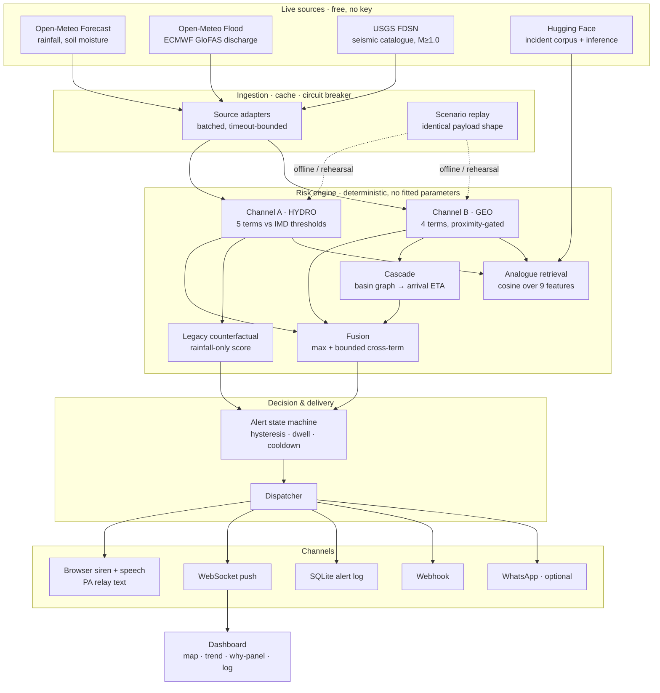

# प्रहरी · PRAHARI

**Dual-channel geohazard early warning — because the last system was listening for rain, not for the mountain moving.**

> On 26 August 2026, a section of the Langtang Lirung glacier collapsed and sent a debris
> flood down the Trishuli valley. 955+ dead. Nearly 4,800 missing. $1.3bn in damage.
> 13 hydropower plants offline.
>
> **Nepal already had an early warning system.** It did not fail for lack of funding.
> It failed because it was calibrated for monsoon river floods, and this event had no rain
> in it at all. The upstream stations were destroyed before they could report.
>
> Prahari watches both channels.

---

## The thesis, in one screenshot

Run the Langtang scenario and stop at the moment of detachment. The dashboard reports:

```
6 zones · 16,37,980 people at risk that a rainfall-only system reports as NORMAL
```

Then flip the **Risk engine** toggle to *Legacy (rainfall only)* — the exact configuration
that was live in the Trishuli valley that morning — and watch every one of those zones
go green while the surge is already 45 minutes downstream.

That is not a slide. It is the same engine, the same data, one channel removed, computed
live in front of you. It is asserted in the test suite:

```python
def test_legacy_engine_misses_langtang_entirely():
    ...
    assert all(r.level == "NORMAL" for r in risks.values())
```

---

## Quickstart

```bash
git clone <this repo> && cd Hackathon_BUILD_ANYTHING_20Sept
./run.sh                 # creates the venv, installs deps, starts on :8000
```

Then open **http://localhost:8000**. That is the whole setup. No API keys, no database,
no build step, no account anywhere.

```bash
make demo     # guaranteed-offline replay mode  <- use this on stage
make test     # 40 tests
make run      # live feeds, automatic replay fallback
```

**On your phone:** find your laptop's LAN IP (`ipconfig getifaddr en0` / `hostname -I`) and
open `http://<that-ip>:8000`. The layout is built mobile-first and the siren and speech
work on a phone browser.

---

## What it actually does

### Two independent channels, fused without dilution

| | **Channel A — HYDRO** | **Channel B — GEO** |
|---|---|---|
| Watches | rainfall intensity, 24h accumulation, intensification trend, modelled river discharge, antecedent saturation | seismic energy, focal depth, mass-movement signature, event clustering |
| Live source | Open-Meteo Forecast API + Open-Meteo Flood API (ECMWF GloFAS) | USGS FDSN event catalogue |
| Catches | Assam 2026 — slow-onset rainfall floods | Langtang 2026 — clear-sky debris floods |
| Anchored to | IMD/DHM published rainfall categories | mass-movement seismic signature, M1.8–4.8 at ≤10 km depth |

Fusion is `R = max(A, B) + κ·(min/100)·(max/100)·100`.

**Never a mean.** Averaging a screaming channel with a silent one produces a calm number —
that is precisely how a two-sensor system talks itself out of an alarm. The maximum
guarantees a quiet channel can never dilute a loud one; the bounded cross-term still lets
two moderate signals outrank one.

### Downstream cascade with arrival countdowns

A mass-movement detection upstream is a *scheduled* emergency downstream. Prahari walks
the basin reach graph and hands every zone below the source an arrival estimate, summed
per reach because a debris flood decelerates as the valley flattens.

```
Langtang headwall  →  Rasuwa      22 km    26 min
                   →  Nuwakot     63 km   1h 42m
                   →  Dhading     96 km   3h 06m
                   →  Gorkha     134 km   5h 13m
                   →  Chitwan    186 km   9h 20m
```

Those countdowns tick live on the dashboard. **26 minutes is the entire product.**

Distance decays the expected *peak*. It does not decay the fact that the water is coming —
so once a detachment is confirmed, every zone in the flow path is floored at WATCH
regardless of distance, and at WARNING inside an hour. Leaving 720,000 people in Chitwan
at NORMAL because they are far away is the same category of error this project exists to fix.

### Explainability, not a black box

Every zone can say, in plain language, exactly why it is the colour it is — which term
dominated, what the raw number was, and which published threshold it was measured against.
No score anywhere in this system is model-generated.

> *Rasuwa is at WARNING (71/100). Dominant driver: M3.8 sits in the 1.8–4.8 window typical
> of slope failure, not tectonic rupture; focal depth 1.2 km is at or near the surface;
> 12 km² of glacier ice and 2 mapped glacial lakes upslope. This is an INHERITED threat:
> ground motion was detected at Langtang Lirung headwall, 22 km upstream. Estimated arrival
> here in 26 minutes at 14.0 m/s average. Local rainfall is not the reason for this level.
> BLIND SPOT: a rainfall-only system would score this zone 30/100 (NORMAL).*

### Historical analogue retrieval

The nine features the engine already computes are cosine-matched against a curated corpus
of documented disasters. A dry seismic signature retrieves Chamoli 2021 and Seti 2012 —
both clear-sky ice-rock avalanches. Heavy rain retrieves the Assam monsoon floods.

**This is retrieval, not prediction.** We cannot validate a trained flood-prediction model
in a day and neither can anyone else; retrieval over an inspectable corpus answers the
question an operator actually asks at 3am — *have we seen this before, and what happened?*

### Alerts designed for people without smartphones

The primary channel is an on-screen siren plus browser speech synthesis, written as relay
text for a **village public-address loudspeaker**. Slowed, action-first, no jargon, repeated:

> *"Emergency flood warning for Rasuwa. A large landslide or ice collapse has been detected
> upstream near Langtang Lirung headwall. Water is expected to reach Rasuwa in approximately
> 26 minutes. Move away from the river immediately and go to higher ground. Do not wait for
> rain. Repeat: move away from the river now."*

*"Do not wait for rain"* is in there because in a clear-sky flood, the absence of rain is
exactly what kills people — there is no reason to believe a warning you cannot see.

Optional channels: generic webhook, and Twilio WhatsApp. Both are **bonus**, off by default,
and nothing in the demo depends on them.

---

## Hugging Face integration

| Use | Needs a token? | What happens without one |
|---|---|---|
| **Incident corpus** — authored as a HF dataset with a full card, read via `datasets.load_dataset`, publishable with `make hf-push` | No | Loads from local JSONL; identical content |
| **Alert briefings** — the structured assessment is phrased by a chat model on the HF router | Yes | Deterministic template produces the same information |
| **Text embeddings** — narrative similarity alongside the numeric match | Yes | Numeric feature-space match only |

The dataset is the load-bearing use; the inference calls are a presentation layer that is
explicitly forbidden from inventing numbers. **The risk score is never model-generated.**

```bash
export HF_TOKEN=hf_...
make hf-push        # publishes corpus + card to the Hub
```

---

## Architecture



Full detail, including the tick loop and every design decision, is in
**[ARCHITECTURE.md](ARCHITECTURE.md)**.
The complete scoring formula with its threshold citations and its honest limitations is in
**[METHODOLOGY.md](METHODOLOGY.md)**.
The demo runbook is **[DEMO_SCRIPT.md](DEMO_SCRIPT.md)**.

---

## Feature status — honestly labelled

**Built and working**

- [x] Live rainfall ingestion from a free, key-less public API
- [x] Live river discharge from ECMWF GloFAS — a genuine second hydrological input
- [x] Live seismic ingestion at a low magnitude floor, regionally bounded
- [x] Transparent rule-based scoring, every weight visible in the UI and at `/api/methodology`
- [x] Ward-level zone registry — 10 named zones, 33 named wards, across two countries
- [x] Colour-banded live risk view with numbered map markers and a numbered zone list
- [x] Real-time trend chart: fused score vs the rainfall-only counterfactual
- [x] Automatic alert triggering with hysteresis, dwell and cooldown
- [x] On-screen siren + speech synthesis, written for loudspeaker relay
- [x] Downstream cascade with live arrival countdowns
- [x] "Why is this red" panel citing the actual numbers and thresholds
- [x] Historical analogue retrieval over a Hugging Face dataset
- [x] Alert history log with dispatch record, in SQLite
- [x] Mobile-responsive layout, verified at 390px
- [x] Scenario replay for two documented 2026 events
- [x] Legacy-engine toggle — the counterfactual, computed live
- [x] On-demand alert drill button
- [x] Feed health panel with circuit-breaker state
- [x] Accessible table view of the chart; status never carried by colour alone
- [x] Optional WhatsApp and webhook fan-out

**Roadmap — described, deliberately not built**

- [ ] Community loudspeaker / PA integration for areas with no smartphone access
- [ ] SMS fallback for feature phones
- [ ] Direct integration with official DHM / CWC hydrology feeds, replacing the public
      weather-API proxy with authoritative river-gauge data
- [ ] Dedicated ground-motion sensor networks to catch sub-catalogue signals — the Langtang
      collapse registered seismically but was not a tectonic earthquake, and a production
      system should not be waiting for USGS to catalogue it
- [ ] InSAR / satellite slope-deformation monitoring as a slow-onset precursor channel

---

## What this is not

Worth saying plainly, because the gap between what a demo claims and what it does is
usually where these projects lose credibility:

- **It does not predict earthquakes.** Channel B detects mass movement that has *already
  started*, from its seismic signature. Nobody can predict earthquakes.
- **It does not forecast weather.** It consumes a published forecast and scores it.
- **It is not a trained ML model**, and it does not pretend to be. Every number is a fixed,
  published weight applied to a measured input. That is a feature: it can be audited by a
  district officer with a calculator, and it cannot silently drift.
- **The scenario replays are recorded, not simulated physics.** The arrival times come from
  the real basin reach graph, but the rainfall and seismic frames are authored.
- **The 2026 casualty figures are as-reported**, carried with `confidence` and `source_note`
  fields in the corpus. Verify against final official assessments before quoting publicly.

---

## Project layout

```
backend/
  config.py         env-driven settings, all optional
  zones.py          zone + basin registry, cascade graph
  orchestrator.py   the tick loop
  main.py           REST + WebSocket API
  store.py          SQLite alert log & score history
  sources/          openmeteo · usgs · huggingface · replay  (+ breaker base)
  engine/           hydro · geo · fusion · analogue · explain · state · curves
  alerts/           delivery channels
frontend/           no build step — vendored Leaflet + Chart.js, ES modules
data/
  zones.json        10 zones, 2 basins, reach topology
  hf_dataset/       incident corpus + HF dataset card
  scenarios/        generated replay frames
scripts/            build_scenarios.py · push_to_hf.py
tests/              40 tests
```

---

## Credits & licence

Built for the BUILD ANYTHING hackathon, 20 September 2026. MIT licensed (see `LICENSE`).
Corpus released CC-BY-4.0.

Data: [Open-Meteo](https://open-meteo.com) (weather + GloFAS flood),
[USGS Earthquake Hazards Program](https://earthquake.usgs.gov) (seismic),
[Hugging Face](https://huggingface.co) (dataset hosting + inference).
Rainfall thresholds follow published IMD categories.

*Prahari (प्रहरी) — "sentinel", "the one who keeps watch" — in Nepali and Hindi.*
